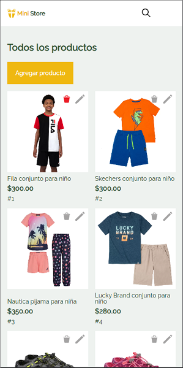

# OneNextEducation-Ecommerce
Challenge focused in web design for a e-commerce

Para poner en práctica los conocimientos adquiridos sobre HTML, CSS y Javascript se realizó este pequeño proyecto que consiste en una aplicación web para un e-commerce. Se empleó Node.js para crear el Back-End mediante el conocido "Fake" Rest Api con un JSON-Server alojado en el host gratuito Render (https://render.com/).

LINK: https://keinetm.github.io/OneNextEducation-Ecommerce/index.html

 
 Gracias al back-end es posible generar dinámicamente el contenido referente a los productos desde la información contenida en la base de datos, mientras se realizan las consultas CRUD correspondientes para generar una lista de todos los productos, listas de productos por categoría, búsqueda de productos por palabras clave. Además, contiene formularios para el registro y validación de credenciales para el inicio de sesión, para agregar nuevos productos, eliminarlos o editarlos; con el extra de poder consultar cada producto individualmente en una página con detalles. 
 El diseño incluye la implementación de un diseño responsivo que se adapta a desktop, tablet y smartphone.
 
  
  
